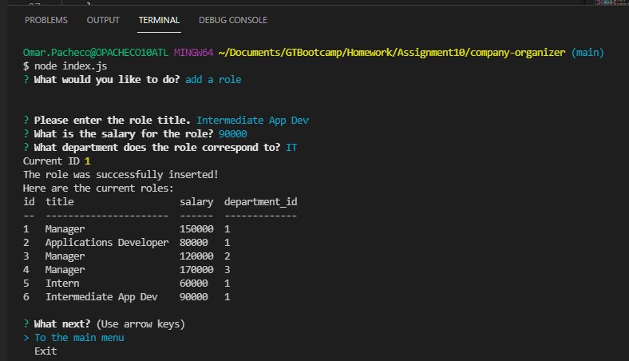

# company-organizer
The company-organizer is a command line application that connects to a locally hosted database. It allows the user the ability to create and view departments, roles, and employees. In addition to this, it allows the user to update the employee's role.

## What was the point?
The point of this application is to give the user the ability to manage a company's employees, roles, and departments stored on a locally hosted database. For me, the point was to get some experience hosting a MySql database as well as some work with the <a href="https://github.com/sidorares/node-mysql2">mysql2</a> node package.

## Lessons Learned
This was some of the most I've gotten to work with Promises and async functions so there was a bit of a learning curve there. I'm definitely more familiar with it but still plenty of room to improve.

## Usage Information
Of course! Take a look at the video below which will get you started!\
<a href="">Demo Video</a>

## Installation
(You will need to have MySql installed. I used the CLI MySql tool)
1. Clone it
2. Run an npm install in the root folder
3. Run the schema.sql file
4. If you want seed data, run the seeds.sql file
5. Run node index.js from the root
6. Enjoy!

## Improvements
* Add more functionality to the existing tables such as DELETE and UPDATE on all entities
* Add more tables that make sense
* Give more ability as to where the user can make updates to various things
* Introduce ability to exit the questions in case the user accidentally hit the wrong option

## Screenshots

